<picture>
  <source media="(prefers-color-scheme: dark)" srcset="./dark.svg" />
  <source media="(prefers-color-scheme: light)" srcset="./light.svg" />
  
</picture>

  
  
  
  

## 📈 GitHub Stats

  
  

## ⚔️ CodeWars

